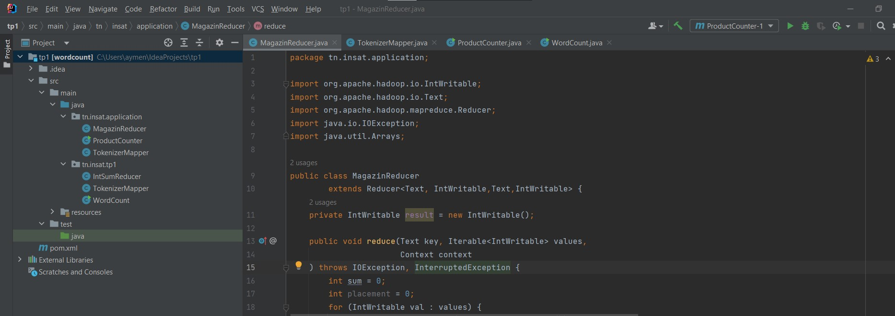
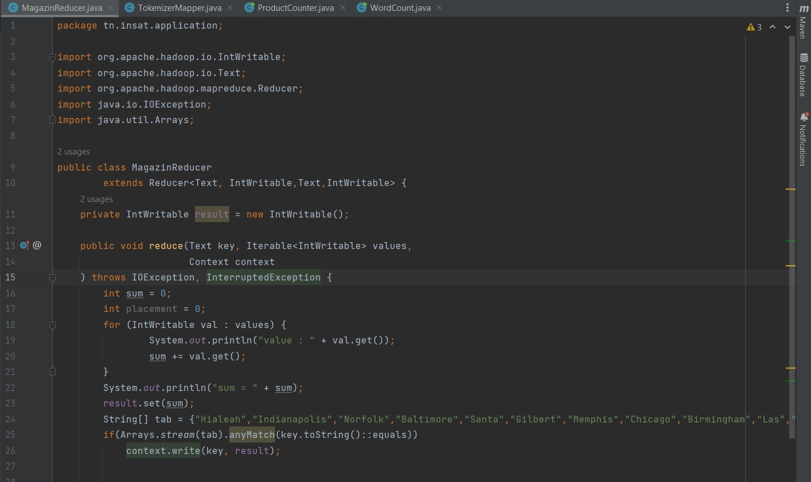
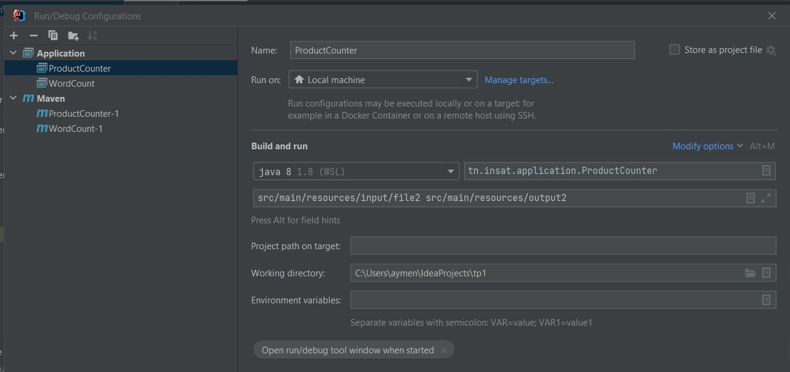
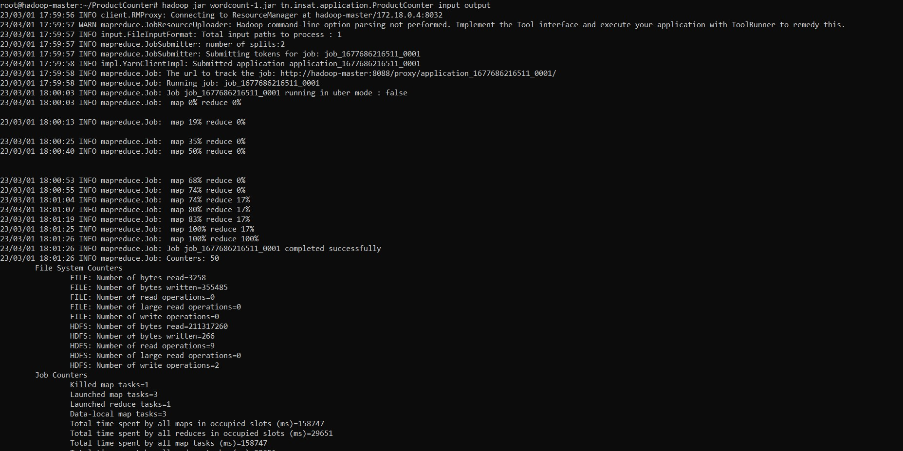
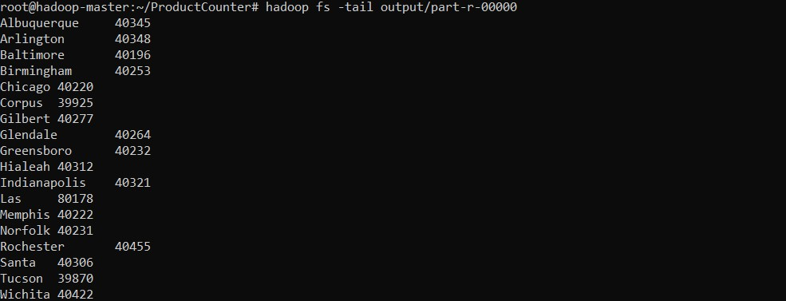

## Compte rendu du TP n° 1 : Le traitement Batch avec Hadoop HDFS et Map Reduce

### Réalisé par Fourati Aymen & Helali Eya


#### Objectifs du TP : 
Initiation au framework hadoop et au patron MapReduce, utilisation de docker pour lancer un cluster hadoop de 3 noeuds.


# Préparation de l'environement

``` 
Creation et lancement des trois contenaires :
Hadoop Master 
Hadoop slave 1 
Hadoop slave 2 
```

``` 
Lancement de hadoop et yarn
```

``` 
Affichage du contenu du fichier purchases.txt
```

# Interfaces web pour Hadoop


# Wordcount
## Tester Map Reduce en local
``` 
Creation d'une configuration de type application
```

``` 
output : 
```

## Lancer Map Reduce sur le cluster

``` 
Creation d'un configuration Maven avec une ligne de commande : 
package install 
```

``` 
Copie du fichier target/wordcount-1.jar vers hadoop-master:/root
```

``` 
Lancement du job map reduce
```

``` 
Affichage des dernières lignes du chier généré output/part-r-00000,
```


``` 
Affiche de la Page web de monitoring des Jobs Map Reduce
```


``` 
Affichage des interfaces webs des noeuds esclaves pour analyzer leurs comportements :
```


# Application
### Écrire un Job Map Reduce permettant, à partir du chier purchases initial, de déterminer le total des ventes par magasin
``` 
Création d'un module tn.insat.application dans lequel nous avons definis trois classes :
- TokenizerMapper : le mapper de notre job qui est tres similaire a celui du job wordcount
- MagasinReducer : Le reducer chargé du parsing des champs dans le fichier purchases.txt afin de pouvoir en tirer les valeurs des redondances de chaque magasin.
- ProductCounter : Notre classe main
```

```
Le reducer : 
```

```
La configuration maven atravers laquel nous avons copier le fichier .jar vers notre contenaire master et lancer notre job evidement apres nombreux testes locaux
```

```
Output : 
```

